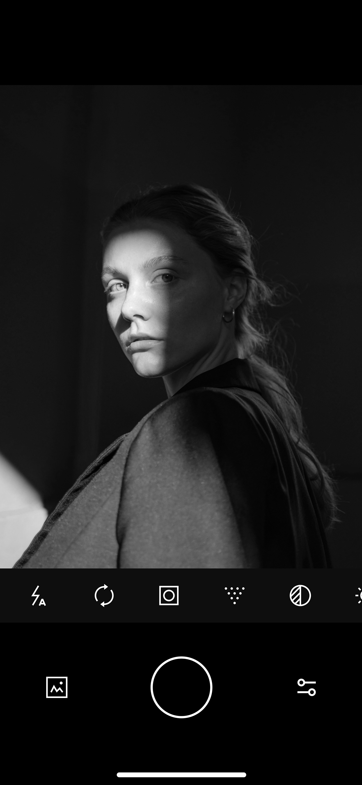
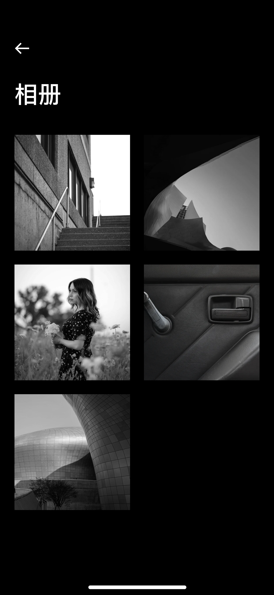

<p align="center">
    
    <h1 align="center">RavenCam</h1>
    <p align="center">A minimal black-and-white camera</p>
    <p align="center">
        English | <a href="README.md">简体中文</a>
    </p>
    <p align="center">
        <a href="https://apps.apple.com/app/id1527902937">
            
        </a>
        <a href="https://developer.apple.com/ios/">
            
        </a>
        <a href="https://swift.org">
            
        </a>
        <a href="https://github.com/nswbmw/ravencam/blob/master/LICENSE">
            
        </a>
        <a href="https://swift.org/package-manager/">
            
        </a>
    </p>
</p>

## Features

- **Real-time B&W Filter** — Live preview powered by Core Image
- **Parameter Controls** — Exposure, contrast, sharpen, vignette, noise, blur
- **Flash Control** — On / Off / Auto
- **Camera Switch** — One-tap switch between front and rear cameras
- **Date Watermark** — Optional shooting date overlay
- **Lossless Capture** — High-resolution photo output
- **Geolocation** — Optional location recording
- **Built-in Album** — Browse, zoom, share, and delete photos
- **EXIF Read/Write** — Photo parameters saved to EXIF data

## Screenshots

| Camera | Adjustments | Album |
|:---:|:---:|:---:|
|  |  |  |

## Requirements

- iOS 18.6+
- Xcode 16+
- Swift 5

## Dependencies

Managed via Swift Package Manager:

- [SnapKit](https://github.com/SnapKit/SnapKit) — Auto Layout DSL
- [DefaultsKit](https://github.com/nmdias/DefaultsKit) — Strongly-typed UserDefaults wrapper

## Getting Started

1. Clone the repository
   ```bash
   git clone https://github.com/nswbmw/ravencam.git
   ```
2. Open `ravencam.xcodeproj` in Xcode
3. Xcode will automatically resolve SPM dependencies
4. Select a target device and hit Run

## Project Structure

```
ravencam/
├── AppDelegate.swift          # App lifecycle
├── SceneDelegate.swift        # Scene management
├── Controller/
│   ├── CameraViewController/  # Main camera UI
│   ├── CameraController.swift # Camera control & filter pipeline
│   ├── PageViewController.swift # Page-based container
│   ├── AlbumViewController/   # Photo album browser
│   │   └── PhotoPreviewController/ # Full-screen photo preview & zoom
│   └── SettingViewController/ # Settings page
├── Model/
│   ├── Photo.swift            # Photo parameters model
│   └── PhotoWithImage.swift   # Photo with image model
├── View/                      # Custom UI components
├── Util/
│   ├── Cache.swift            # UserDefaults cache
│   └── Util.swift             # Utility functions
├── Extension/                 # UIImage / UIView / Float extensions
├── Class/                     # Gesture & photo utility classes
├── CustomBlurEffectView/      # Custom blur effect
└── Resource/                  # Font resources
```

## License

[MIT](LICENSE)
